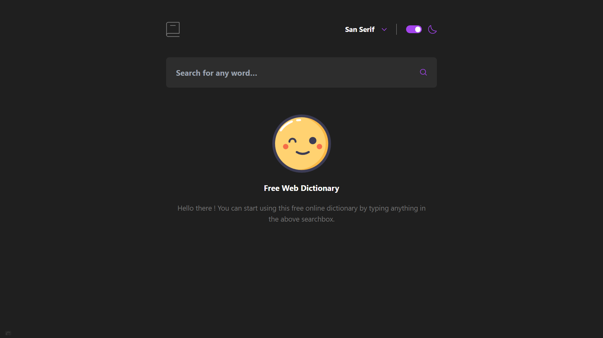

### The challenge

Your users should be able to:

- Search for words using the input field
- See the Free Dictionary API's response for the searched word
- See a form validation message when trying to submit a blank form
- Play the audio file for a word when it's available
- Switch between serif, sans serif, and monospace fonts
- Switch between light and dark themes
- View the optimal layout for the interface depending on their device's screen size
- See hover and focus states for all interactive elements on the page
- **Bonus**: Have the correct color scheme chosen for them based on their computer preferences. Hint: Research prefers-color-scheme in CSS.

### Screenshot

### Links

- Solution URL: [Add solution URL here](https://github.com/aleksFedotov/dictionary-web-app)
- Live Site URL: [Add live site URL here](https://dictionary-web-app-black.vercel.app/)

### Built with

- [Sveltekit](https://kit.svelte.dev/) - JS framework
- [Tailwind](https://tailwindcss.com/) - CSS framework
- [Vitest](https://vitest.dev/) - Test framework
- [Testing Library](https://testing-library.com/) - Testing utility tool
